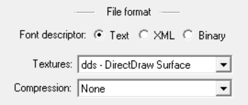
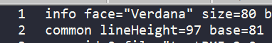
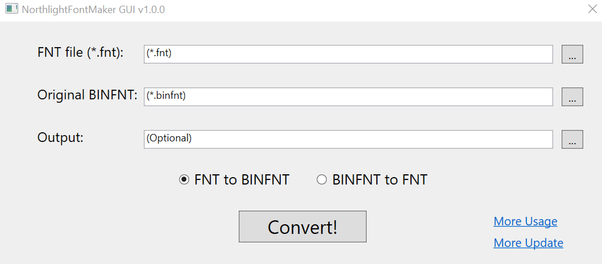

# NorthlightFontMaker
NorthlightFontMaker is a tool used to create/edit custom bitmap fonts for Northlight engine (Alan Wake series, Quantum Break, Control and more... )

## Installation

- Download [lastest release](https://github.com/eprilx/NorthlightFontMaker/releases).
- Run `NorthlightFontMakerGUI.exe` (or run NorthlightFontMaker.exe in the cmd)

## Building from source
- **[Install .NET 5](https://dotnet.microsoft.com/download/dotnet/5.0)**
- ``git clone --recurse-submodules https://github.com/eprilx/NorthlightFontMaker.git``

## Usage

❄ **Convert FNT to BINFNT (Create new BINFNT)**

```
NorthlightFontMaker --fnt2binfnt -f <path binfnt> -b <path fnt> [-o] <path export new binfnt>
```
Example: `NorthlightFontMaker --fnt2binfnt -f customer_facing.binfnt -b test.fnt -o customer_facing.binfnt.new`
1. Use [BMFont](https://www.angelcode.com/products/bmfont/) or [Hiero](https://github.com/libgdx/libgdx/wiki/Hiero) to generate FNT and DDS file.
2. The tool will automatically import the DDS file, so you should follow these steps:
- For BMFont user, go to Options then Export Options, on `Textures` select dds, on `Compression` select None


- For Hiero user, convert png to dds (using texconv or sth) then rename extension to `_0.dds` (example: test.png -> test.dds -> test_0.dds). After that, put the dds file next to fnt file.

**Notes**
- Increase "lineHeight" in fnt file to make font display "higher" in game and vice versa.
- Decrease "size" in fnt file to make font "bigger" and vice versa. (it also uses absolute value so |-50| > |-40|)


❄ **Convert BINFNT to FNT**
```
NorthlightFontMaker --binfnt2fnt -f <path binfnt> [-o] <path export fnt>
```
Example: ``NorthlightFontMaker --binfnt2fnt -f customer_facing.binfnt -o customer_facing.binfnt.fnt``

❄ **GUI**



## Thanks to
- [Rick Gibbed](https://github.com/gibbed) ([Gibbed.IO](https://github.com/gibbed/Gibbed.IO) library)

## TODO
Make a wiki about the structure of binfnt.

## License
[MIT](LICENSE)
